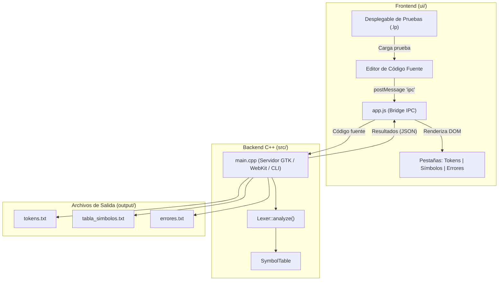

# LexLP Studio — Analizador Léxico (Lenguaje LP)

[](https://isocpp.org/)
[](https://www.gtk.org/)
[](https://developer.mozilla.org/)


**LexLP Studio** es el analizador léxico (Fase 1 del compilador) para el lenguaje de programación personalizado **LP**.

El proyecto implementa una arquitectura híbrida de alto desempeño: un **backend en C++17** que procesa el flujo léxico, gestiona la tabla de símbolos y detecta errores en una sola pasada, conectado mediante un **puente IPC nativo (GTK 3 + WebKit2GTK)** a una **interfaz gráfica moderna (UI)** desarrollada con tecnologías web. Además, cuenta con un **modo CLI** optimizado para evaluación y pruebas automatizadas por terminal.

---

## 🚀 Características Principales

* **Motor Léxico Integral (C++17):**
  * Reconocimiento según la regla del prefijo más largo (*Maximal Munch*) y autómatas finitos deterministas (DFA).
  * Soporte de *lookahead* para resolver operadores de 1 y 2 caracteres (`=`, `==`, `!`, `!=`, `<`, `<=`, `>`, `>=`, `&&`, `||`, `/`, `//`).
  * Normalización automática de comillas tipográficas UTF-8 (`“ ”`) a comillas dobles estándar (`"`).
  * Filtrado y descarte transparente de comentarios de una línea (`//.*\n`) actualizando filas y columnas.
* **Manejo Robusto de Errores Léxicos (Sin Falsos Positivos):**
  * **Números mal formados consolidados:** Cadenas inválidas como `1.2.3`, `1..2`, `42.` o `123abc` son absorbidas como un único error léxico en lugar de dividirse erróneamente en tokens parciales.
  * **Identificadores inválidos agrupados:** Variables ilegales como `@variableInvalida` o `$precio` se marcan completas como error léxico, evitando contaminar la tabla de símbolos o emitir tokens `<ID>` falsos.
  * **Cadenas no cerradas:** Detección de constantes de texto que no cierran comillas antes del salto de línea o fin de archivo.
* **Tabla de Símbolos en Tiempo Real:**
  * Almacenamiento en estructura híbrida (`std::unordered_map` y `std::vector`) para inserción y búsqueda en $O(1)$ garantizando orden secuencial sin identificadores duplicados.
  * Asociación de atributos posicionales en el formato `<ID, pos>`.
* **Doble Modo de Ejecución:**
  * **Modo GUI (Escritorio):** IDE interactivo con selector desplegable de pruebas, visor de tokens por categorías, tabla de símbolos y lista de errores en vivo.
  * **Modo CLI (Terminal):** Ejecución directa (`./lexlp archivo.lp`) diseñada para calificación automatizada.
* **Exportación Automática a Disco (`output/`):**
  * Genera tras cada análisis los archivos exigidos para la entrega: `tokens.txt`, `tabla_simbolos.txt` y `errores.txt`.

---

## 📁 Estructura del Proyecto

```text
.
├── Makefile                # Script de compilación (g++ C++17, GTK 3, WebKit2GTK)
├── README.md               # Documentación general del proyecto
├── lexlp                   # Binario ejecutable compilado
├── output/                 # Reportes generados en texto plano
│   ├── errores.txt         # Reporte tabulado de errores léxicos
│   ├── tabla_simbolos.txt  # Tabla de símbolos con identificadores únicos
│   └── tokens.txt          # Secuencia lineal continua de tokens
├── src/                    # Código fuente del motor en C++
│   ├── Lexer.h / .cpp      # Escáner léxico, DFA, lookahead y reglas
│   ├── SymbolTable.h / .cpp# Tabla de símbolos (hash map + vector)
│   ├── Token.h / .cpp      # Estructuras Token, LexerError y TokenType
│   └── main.cpp            # Punto de entrada, modo CLI y ventana GTK/WebKit
├── tests/                  # Suites de prueba oficiales en lenguaje LP
│   ├── prueba_basica.lp    # Aritmética, variables y salida básica
│   ├── prueba_completa.lp  # Cobertura integral de tipos, control y operadores
│   ├── prueba_errores.lp   # Símbolos inválidos (@, $), 1.2.3, cadenas abiertas
│   └── prueba_limite.lp    # Casos límite (guiones bajos, números mal formados)
└── ui/                     # Frontend de la interfaz gráfica
    ├── app.js              # Lógica de cliente, puente IPC y renderizado dinámico
    ├── index.html          # Vista HTML del editor y paneles de resultados
    └── style.css           # Estilos visuales con tema oscuro tipo IDE
```

---

## 📜 Especificación de Tokens y Expresiones Regulares

| Expresión Regular | Token Generado | Formato de Salida | Categoría |
| :--- | :---: | :---: | :--- |
| `D = [0-9]` *(Auxiliar)* | — | — | Dígito numérico |
| `L = [a-zA-Z_]` *(Auxiliar)* | — | — | Carácter de identificador |
| `NUM_INT = D+` | `NUM_INT` | `<NUM_INT>` | Número entero |
| `NUM_DEC = D+\.D+` | `NUM_DEC` | `<NUM_DEC>` | Número decimal |
| `ID = L(L\|D)*` | `ID` | `<ID, pos>` | Identificador *(con posición en tabla)* |
| `TEXTO = “.*”` o `".*"` | `TEXTO` | `<TEXTO>` | Constante de texto |
| `int`, `float`, `char`, `boolean`, `void` | `INT`, `FLOAT`, etc. | `<TIPO>` | Palabras reservadas (Tipos) |
| `if`, `else`, `for`, `while` | `IF`, `ELSE`, etc. | `<PALABRA>` | Palabras reservadas (Control) |
| `scanf`, `println`, `main`, `return` | `SCANF`, `PRINTLN`, etc. | `<PALABRA>` | Palabras reservadas (E/S y función) |
| `COMENT = //.*\n` | *(Ignorado)* | — | Comentario de una línea *(sin token)* |
| `=` | `=` | `<=>` | Operador de asignación |
| `+`, `-`, `*`, `/`, `%` | `+`, `-`, `*`, `/`, `%` | `<+>`, `<->`, etc. | Operadores aritméticos |
| `&&`, `\|\|`, `!` | `&&`, `\|\|`, `!` | `<&&>`, `<\|\|>`, `<!>` | Operadores lógicos |
| `COMP = > \| >= \| < \| <= \| != \| ==` | `COMP` | `<COMP>` | Operadores de comparación / relacionales |
| `(`, `)`, `[`, `]`, `{`, `}`, `,`, `;` | `(`, `)`, etc. | `<(>`, `<;>`, etc. | Símbolos especiales / delimitadores |

---

## ⚙️ Arquitectura y Flujo de Comunicación



---

## 🛠️ Instalación y Compilación

### Prerrequisitos (Linux)

El proyecto requiere un compilador con soporte para **C++17** y las librerías de desarrollo de **GTK+ 3** y **WebKit2GTK** (versión 4.1 o 4.0):

#### En Ubuntu / Debian / Linux Mint:
```bash
sudo apt update
sudo apt install build-essential pkg-config libgtk-3-dev libwebkit2gtk-4.1-dev
# Si tu distribución utiliza la rama 4.0:
# sudo apt install libwebkit2gtk-4.0-dev
```

#### En Arch Linux / Manjaro:
```bash
sudo pacman -S base-devel pkgconf gtk3 webkit2gtk-4.1
```

#### En Fedora / RHEL:
```bash
sudo dnf install gcc-c++ make pkgconfig gtk3-devel webkit2gtk4.1-devel
```

### Compilación

Para compilar el proyecto y generar el binario ejecutable `lexlp`:

```bash
# Compilación estándar
make

# Limpieza y recompilación completa desde cero
make clean && make
```

---

## 🚀 Uso del Programa

### 1. Modo Gráfico (GUI)
Ejecuta el binario sin argumentos:
```bash
./lexlp
```
1. En la barra superior, usa el **menú desplegable** para elegir cualquiera de las pruebas disponibles (`prueba_basica.lp`, `prueba_completa.lp`, `prueba_errores.lp`, `prueba_limite.lp` o el ejemplo estándar).
2. Modifica o escribe código libremente en el panel izquierdo.
3. Presiona **▶ Analizar Código**.
4. Revisa los resultados en las pestañas derechas:
   * **Tokens:** Etiquetas coloreadas con formato `<TIPO>` o `<ID, pos>`.
   * **Tabla de Símbolos:** Relación `Posición` e `Identificador`.
   * **Errores Léxicos:** Tabla con `Línea`, `Columna`, `Lexema` y estado `ERROR_LEXICO`.

### 2. Modo Consola (CLI)
Ideal para pruebas automatizadas y corrección docente por lotes:
```bash
./lexlp tests/prueba_basica.lp
./lexlp tests/prueba_completa.lp
./lexlp tests/prueba_errores.lp
./lexlp tests/prueba_limite.lp
```
El analizador procesará el archivo fuente, imprimirá un mensaje de confirmación y escribirá las salidas en la carpeta `output/`.

---

## 🧪 Casos de Prueba Incluidos (`tests/`)

* **[`tests/prueba_basica.lp`](tests/prueba_basica.lp):** Declaración de variables `int` y `float`, operadores aritméticos básicos (`+`, `*`), cadenas de texto y llamada a `println`.
* **[`tests/prueba_completa.lp`](tests/prueba_completa.lp):** Cobertura exhaustiva de palabras clave, tipos (`char`, `boolean`), arreglos unidimensionales (`datos[10]`), bucles `while`/`for`, condicionales `if`/`else`, operadores lógicos compuestos (`&&`, `||`, `!`), comparaciones relacionales (`<=`, `>=`, `!=`) y comentarios.
* **[`tests/prueba_errores.lp`](tests/prueba_errores.lp):** Verificación de detección de símbolos no permitidos (`@variableInvalida`, `$precio`), operadores lógicos solitarios (`&`, `|`), números mal formados (`1.2.3`) y cadenas no cerradas.
* **[`tests/prueba_limite.lp`](tests/prueba_limite.lp):** Casos límite (*edge cases*): identificadores válidos con guiones bajos iniciales (`_contador`, `__init__`), decimales sin dígitos tras el punto (`42.`), múltiples puntos (`1..2`, `1.2.3.4`), números pegados a letras (`123abc`, `1.2x`) y cadenas con comillas escapadas.

---

## 📄 Archivos de Salida Generados (`output/`)

Tras cada ejecución (tanto en GUI como en CLI), se actualizan automáticamente:

1. **`output/tokens.txt`:** Cadena continua de tokens delimitados por espacios:
   ```text
   <VOID> <MAIN> <(> <)> <{> <INT> <ID,0> <=> <NUM_INT> <;> <RETURN> <;> <}>
   ```
2. **`output/tabla_simbolos.txt`:** Lista tabulada de identificadores únicos registrados:
   ```text
   Posición	Identificador
   0		valorA
   1		valorB
   ```
3. **`output/errores.txt`:** Reporte tabulado de fallos léxicos detectados:
   ```text
   Línea	Columna	Lexema	Resultado
   5	9	@variableInvalida	ERROR_LEXICO
   9	28	1.2.3	ERROR_LEXICO
   ```