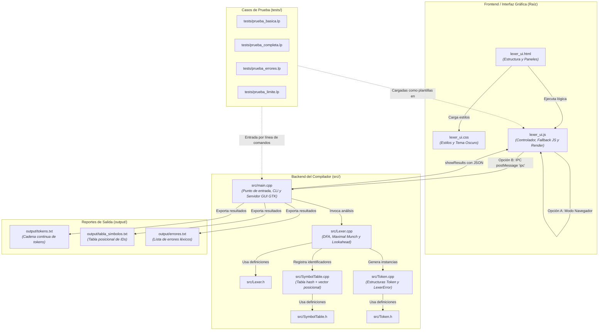

# Memoria Técnica de Corrección y Conexión de Archivos: LexLP Studio (`lexer_ui`)

---

## 1. Informe General de los Cambios Realizados

El componente `lexer_ui` fue diseñado como una interfaz gráfica de usuario (GUI) moderna e interactiva para el compilador del lenguaje **LP** (Lenguajes de Programación). Sin embargo, presentaba varios problemas estructurales y lógicos que impedían su funcionamiento:

1. **Rutas rotas de recursos externos:**
   El archivo `lexer_ui.html` hacía referencia en sus etiquetas `<link>` y `` por ``.
* **Garantía de IDs y selectores:** Se verificaron y sincronizaron los identificadores del DOM (`#codeEditor`, `#lineColCounter`, `#sampleSelect`, `#analyzeBtn`, `#tokensContainer`, `#symbolTableBody`, `#errorsTableBody`, etc.) con la lógica de control.

### B. Archivo `lexer_ui.js`
* **Implementación de un Motor Léxico Completo en JavaScript (`runJsLexer`):**
  Se programó un analizador léxico determinista en JavaScript que replica exactamente el autómata finito, el criterio de prefijo más largo (*Maximal Munch*) y las reglas de `src/Lexer.cpp`:
  * Reconocimiento de palabras reservadas del lenguaje LP: `int`, `float`, `char`, `boolean`, `void`, `if`, `else`, `for`, `while`, `scanf`, `println`, `main`, `return`.
  * Identificadores `[a-zA-Z_][a-zA-Z0-9_]*` y asignación de posición incremental en la tabla de símbolos.
  * Constantes numéricas enteras (`NUM_INT`) y decimales (`NUM_DEC`).
  * Agrupación y absorción de números mal formados (`1.2.3`, `1..2`, `42.`, `123abc`) como un único error léxico.
  * Cadenas de texto con comillas estándar (`"..."`) y comillas tipográficas UTF-8 (`“...”`), con detección de cadenas no cerradas.
  * Descarte de comentarios de una línea (`//...\n`) manteniendo el conteo de líneas y columnas.
  * Operadores de 1 y 2 caracteres: `==`, `=`, `!=`, `!`, `<=`, `<`, `>=`, `>`, `&&`, `||`, `+`, `-`, `*`, `/`, `%`.
  * Delimitadores: `(`, `)`, `[`, `]`, `{`, `}`, `,`, `;`.
  * Identificadores y símbolos inválidos agrupados (`@variableInvalida`, `$precio`).
* **Soporte Híbrido (Navegador y WebKitGTK):**
  La función `window.analyzeCode` detecta si está ejecutándose dentro del contenedor nativo WebKitGTK (`window.webkit.messageHandlers.ipc`). Si es así, delega el procesamiento al backend en C++; de lo contrario, ejecuta el motor léxico en JavaScript de forma instantánea.
* **Sincronización de Suites de Prueba:**
  Se actualizaron los casos de prueba del menú desplegable para reflejar fielmente los archivos oficiales de `tests/`:
  * `standard`: Demostración general de variables, condicionales y error léxico.
  * `basic`: Expresiones aritméticas y variables (`tests/prueba_basica.lp`).
  * `complete`: Cobertura exhaustiva de control, arreglos y operadores (`tests/prueba_completa.lp`).
  * `errors`: Detección de fallas léxicas (`tests/prueba_errores.lp`).
  * `edge_cases`: Casos límite y delimitación de lexemas (`tests/prueba_limite.lp`).
* **Mejoras de Usabilidad:**
  * Atajo de teclado: `Ctrl + Enter` (o `Cmd + Enter`) en el editor para disparar el análisis inmediatamente.
  * Seguimiento en tiempo real de línea y columna del cursor (`L: ... | C: ...`).
  * Renderizado categorizado con clases CSS (`id-token`, `num-token`, `kw-token`, `op-token`, `sym-token`, `str-token`).
  * Tooltips flotantes al pasar el ratón sobre cada token mostrando su lexema original y su ubicación exacta.

### C. Archivo `lexer_ui.css`
* **Barras de desplazamiento personalizadas:** Se añadieron pseudo-elementos `::-webkit-scrollbar` para mantener la coherencia estética con el tema oscuro del IDE en navegadores modernos.
* **Diseño responsivo:** Se aseguró que el contenedor de dos columnas (`.workspace`) mantenga su distribución 1:1 con áreas de desplazamiento independientes (`overflow-y: auto`).

### D. Archivo `src/main.cpp`
* **Detección prioritaria de interfaz:** Se ajustó la inicialización de la ventana de WebKit para buscar primero `lexer_ui.html` en la raíz. Si existe, la carga con su directorio base correspondiente; si no, recurre a `ui/index.html`.

---

## 3. Lo que se Quitó / Eliminó

1. **Eliminado el Mock Simulado Hardcodeado:**
   Se removió el bloque de código en `lexer_ui.js` que devolvía una cadena fija e inmutable con `int x = 3.5;` y `@`, el cual engañaba al usuario y no analizaba el código real.
2. **Eliminadas Referencias a Archivos Inexistentes:**
   Se eliminaron de `lexer_ui.html` las llamadas a `href="style.css"` y `src="app.js"` que generaban errores de carga.
3. **Eliminadas Definiciones Ajenas al Lenguaje LP:**
   Se quitaron de las muestras de prueba las variables de tipo `string` y sintaxis estilo lenguaje C (`scanf("%d", ...)`) que no forman parte de la gramática léxica de LP.

---

## 4. Diagrama de Conexión de Archivos y Flujo del Sistema

---

## 5. Descripción y Responsabilidad de Cada Archivo del Proyecto

A continuación se detalla abiertamente qué función cumple cada archivo relevante del proyecto:

### A. Interfaz de Usuario y Frontend (`/`)
* **`lexer_ui.html`:**
  Archivo principal de la interfaz visual moderna. Define la estructura semántica de dos paneles: a la izquierda, el editor de código fuente con su indicador de posición (línea y columna); a la derecha, el panel de resultados organizado en pestañas interactivas (*Tokens*, *Tabla de Símbolos* y *Errores Léxicos*). Incluye una barra superior con selector de programas de prueba y botón de ejecución.
* **`lexer_ui.css`:**
  Hoja de estilos CSS3 con una paleta de colores oscura (*Dark Theme*) inspirada en editores profesionales. Configura variables CSS (`:root`), tipografías monoespaciadas para el editor, etiquetas de tokens con distintivos cromáticos según su categoría gramatical (identificador, número, operador, palabra clave, texto o símbolo) y diseño de tablas tabulares con barras de desplazamiento personalizadas.
* **`lexer_ui.js`:**
  Controlador lógico del frontend. Administra los eventos del DOM (cambio de pestañas, atajos de teclado, conteo de cursor, carga de pruebas). Aloja el motor léxico en JavaScript para funcionamiento autónomo en cualquier navegador web y el canal IPC para comunicación bidireccional con el backend en C++. Transforma las estructuras recibidas en elementos DOM interactivos con contadores dinámicos.

### B. Código Fuente del Compilador C++ (`src/`)
* **`src/main.cpp`:**
  Punto de entrada de la aplicación en C++. Gestiona dos modos de ejecución:
  1. *Modo CLI:* Si recibe un argumento por terminal (`./lexlp archivo.lp`), procesa el archivo fuente, escribe las salidas en `output/` y finaliza sin levantar entorno gráfico.
  2. *Modo GUI:* Inicializa la ventana GTK+ 3 con el componente WebKit2GTK, carga `lexer_ui.html`, registra el manejador de mensajes IPC `"ipc"` y envía las respuestas JSON formateadas al script mediante `showResults()`.
* **`src/Lexer.h`:**
  Encabezado que declara la clase `Lexer`, el método estático `analyze` y la función auxiliar de verificación de palabras reservadas `check_keyword`.
* **`src/Lexer.cpp`:**
  Núcleo del analizador léxico. Implementa el recorrido de caracteres basado en autómatas finitos deterministas (DFA) con resolución por *Maximal Munch*. Aplica *lookahead* para resolver operadores compuestos (`==`, `!=`, `<=`, `>=`, `&&`, `||`), maneja comentarios de línea (`//`), normaliza comillas tipográficas, agrupa números mal formados y variables inválidas en un único error consolidado, y coordina la inserción en la tabla de símbolos.
* **`src/Token.h`:**
  Define la enumeración `TokenType` con todos los componentes léxicos admitidos, las funciones de conversión a texto y las estructuras de datos `Token`, `LexerError` y `LexerOutput`, incluyendo métodos para serialización a formato JSON (`to_json()`) y representación textual estándar (`toString()`).
* **`src/Token.cpp`:**
  Unidad de traducción para las implementaciones auxiliares relacionadas con los tokens del lenguaje.
* **`src/SymbolTable.h`:**
  Declaración de la clase `SymbolTable`, responsable de almacenar los identificadores únicos encontrados durante el análisis léxico.
* **`src/SymbolTable.cpp`:**
  Implementa una arquitectura híbrida con `std::unordered_map` (para búsqueda e inserción en tiempo constante $O(1)$ sin duplicados) y `std::vector` (para preservar el orden estricto de aparición y asignar un índice posicional correlativo $0, 1, 2, \dots$). Provee métodos para exportar la tabla a `output/tabla_simbolos.txt` y serializarla a JSON.

### C. Suites de Pruebas Oficiales (`tests/`)
* **`tests/prueba_basica.lp`:**
  Programa elemental que valida la declaración de tipos primitivos (`int`, `float`), asignaciones, operaciones aritméticas básicas (`+`, `*`), cadenas de texto y la invocación a la función reservada `println`.
* **`tests/prueba_completa.lp`:**
  Caso de prueba integral de alta cobertura. Comprueba tipos adicionales (`char`, `boolean`), arreglos unidimensionales (`datos[10]`), estructuras de control (`while`, `for`, `if`, `else`), operadores lógicos (`&&`, `||`, `!`), comparaciones (`<=`, `>=`, `!=`) y comentarios.
* **`tests/prueba_errores.lp`:**
  Programa diseñado para validar la robustez ante fallos léxicos: identificadores ilegales con caracteres prohibidos (`@variableInvalida`, `$precio`), operadores lógicos incompletos (`&`, `|`), números con múltiples puntos (`1.2.3`) y cadenas sin comillas de cierre.
* **`tests/prueba_limite.lp`:**
  Suite de casos límite (*edge cases*): identificadores válidos con guiones bajos iniciales (`_contador`, `__init__`), decimales sin dígitos tras el punto (`42.`), secuencias con puntos múltiples (`1..2`, `1.2.3.4`), números seguidos de letras (`123abc`, `1.2x`) y cadenas con comillas escapadas.

### D. Archivos de Salida Generados (`output/`)
* **`output/tokens.txt`:**
  Archivo de texto plano que almacena la secuencia lineal continua de los tokens reconocidos separados por espacios, en el formato estricto exigido por la entrega (ejemplo: `<VOID> <MAIN> <(> <)> <{> <INT> <ID,0> <=> <NUM_INT> <;> <}>`).
* **`output/tabla_simbolos.txt`:**
  Archivo con formato tabulado que lista los identificadores únicos registrados y su posición entera correspondiente.
* **`output/errores.txt`:**
  Reporte tabulado con cuatro columnas (*Línea*, *Columna*, *Lexema*, *Resultado*) que documenta detalladamente cada error léxico encontrado en el código fuente.

### E. Archivos de Configuración y Compilación
* **`Makefile`:**
  Script de compilación automatizado para el compilador GNU C++ (`g++`). Configura el estándar `C++17`, las banderas de advertencia `-Wall`, la inclusión de librerías mediante `pkg-config` para `gtk+-3.0` y `webkit2gtk-4.1`, y define las reglas `all` y `clean`.
